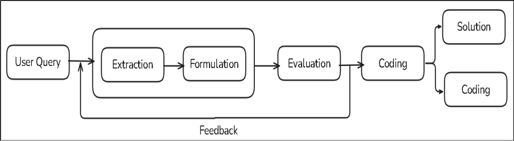
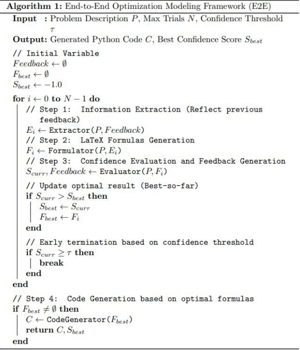
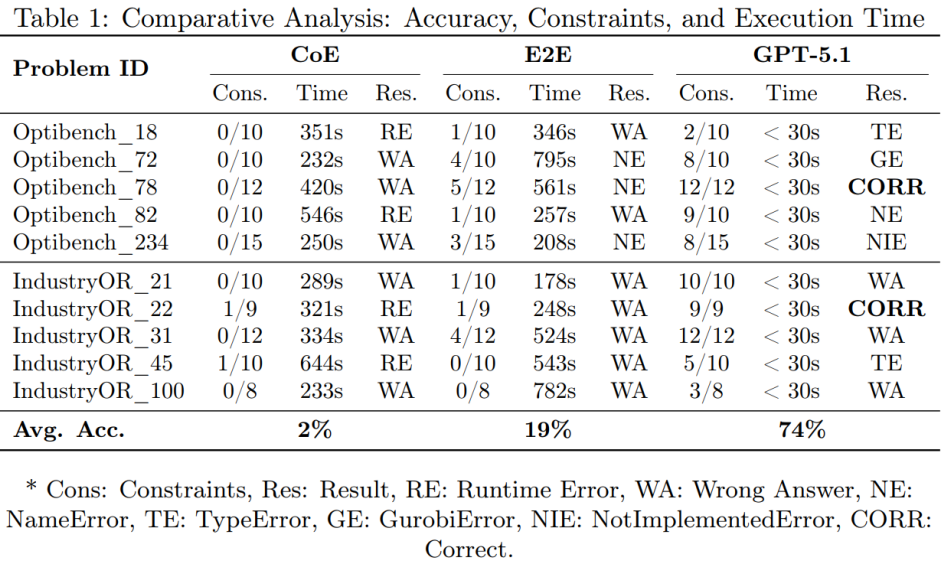

# LLM 기반 최적화 모델 생성 멀티 에이전트 아키텍처 구현

## 1. e2e 모델 구조(E2E model architecture)
  

## 2. 에이전트(Agents)
  *BasicModelInterpreter: 자연어 문제 쿼리에서 인스턴스, 목적함수, 제약조건 등 추출
  
  *ConstraintsInterpreter: BasicModelInterpreter에서 받은 정보를 기반으로 수리적 논리 구조를 구축하고, 이를 LaTeX 수식으로 변환
  
  *Evaluator: 이전 에이전트가 생성한 수식을 검증 및 피드백 제공
  
  *Coder: 완성된 모델링을 해결하는 Solver 코드 생성
  
  *InstanceDataSetGenerator: 문제 쿼리에서 인스턴스 정보를 추출

## 3. e2e 모델 수도코드(pseudo code)
  

## 3. 실험 환경(Experiment setting)
  *모델: Qwen2.5-3B-Instruct
  
  *테스트 데이터셋: newset

  *임계값: 0.8

  *최대 시도 횟수: 3

## 4. 성능 비교(Performance Benchmark)
  
